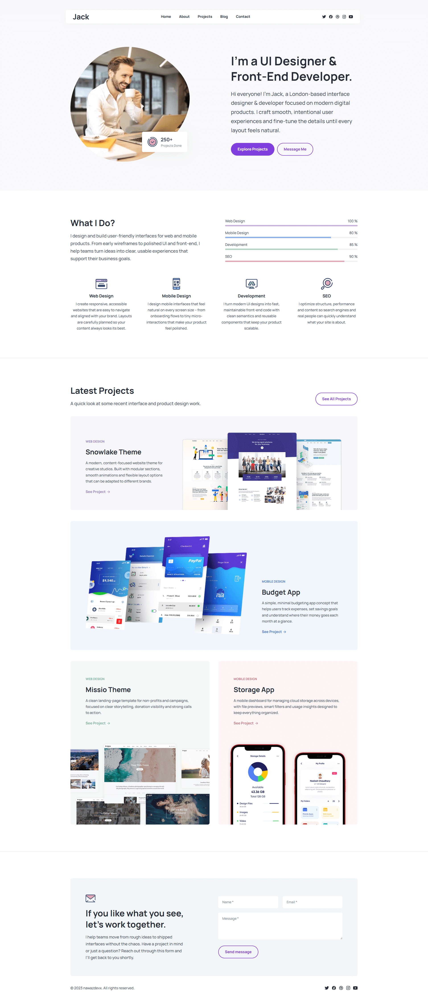

<div>
  <h1>Jack — Personal Portfolio</h1>

  <p>
    A fully responsive personal portfolio website, <br />
    built using HTML, CSS, and JavaScript. Works on all devices.
  </p>

  <p>
    <strong>Note:</strong> I started building HTML, CSS, and JavaScript projects in 2022. <br />
    At that time, I focused on learning first and began uploading to GitHub recently. <br />
    Now I'm working with React.js and Next.js, and seeking opportunities as a frontend or web developer.
  </p>
</div>

## What's Inside
- `index.html` — main page
- `assets/css/style.css` — styles with `:root` CSS variables
- `assets/js/script.js` — mobile navigation and scroll reveal animations
- `assets/images/` — hero images, project screenshots, icons, and logo

## Technologies Used
HTML5 · CSS3 · Vanilla JavaScript · Google Fonts (Manrope) · Ionicons

## Features
- Fully responsive design
- Mobile-friendly navigation
- Smooth scroll animations
- Clean and modern UI
- Easy to customize

## Quick Start
1. **Clone the repository:**  
   ```bash
   git clone https://github.com/nawazdevx/jack-portfolio.git
   ```

2. **Open the project:**  
   - Simply open `index.html` in your browser  
   - Or run a local server:  
     ```bash
     python -m http.server 3000
     ```
     Then visit `http://localhost:3000`

## Customization
- Update site content and meta tags in `index.html`
- Replace images in `assets/images/` (keep the same filenames or update the `src` attributes)
- Change colors and fonts using `:root` variables at the top of `style.css`
- Connect the contact form to a service like Formspree, Netlify Forms, or your own backend

## License
This project is licensed under the [MIT License](https://choosealicense.com/licenses/mit/).

## Contact
If you want to contact me, you can reach me at [LinkedIn](https://www.linkedin.com/in/nawazdevx).

## Support
If you find this project useful, please consider starring it on GitHub ⭐ to show your support!

<br />

<div align="center">
  <h1>Project Preview</h1>
  
  <p>
    You can view the live project here ➜
    <a href="https://nawazdevx.github.io/jack-portfolio/" target="_blank"><strong>Live Demo</strong></a>
  </p>

  
</div>